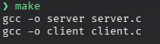
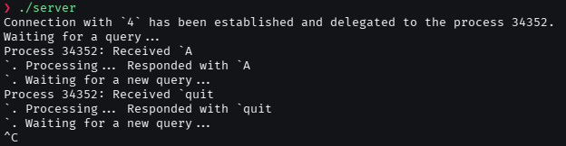
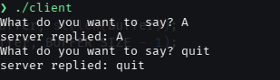
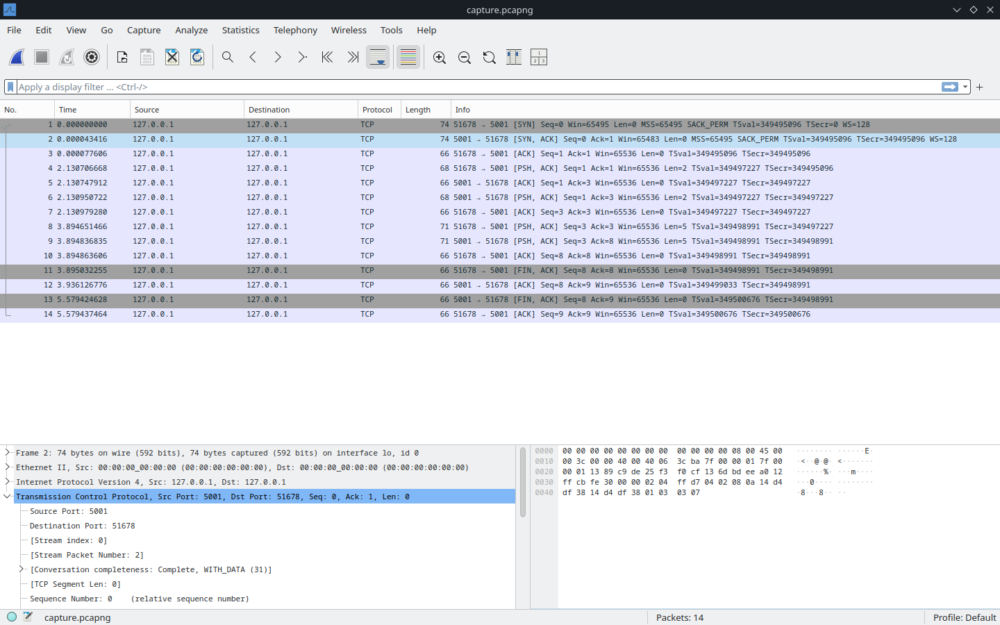
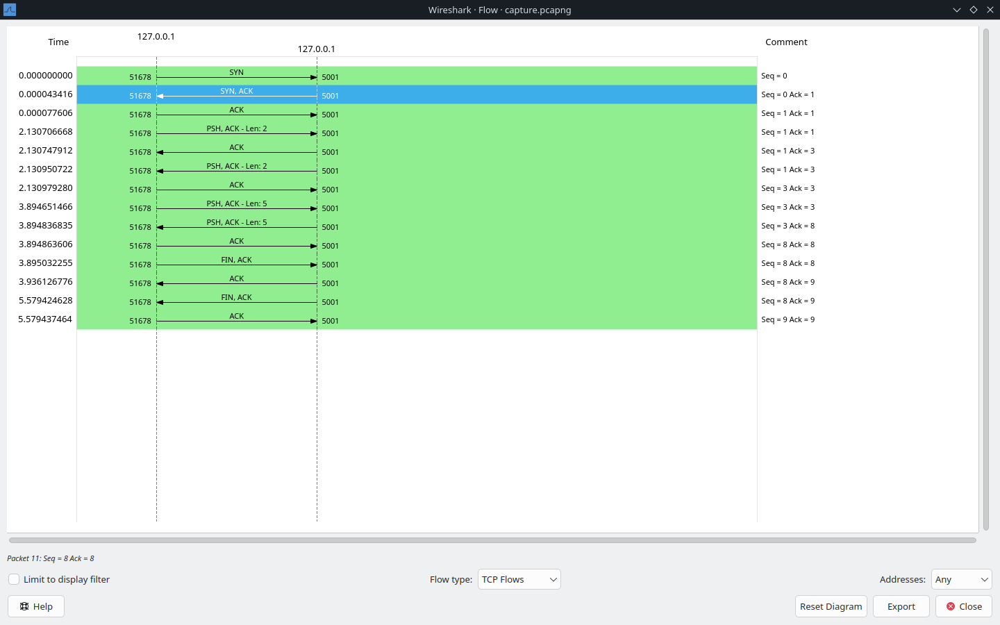
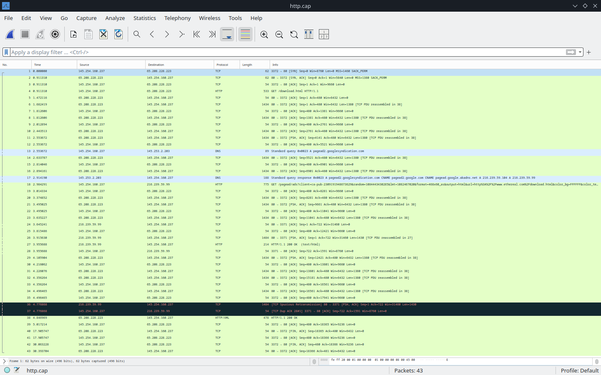
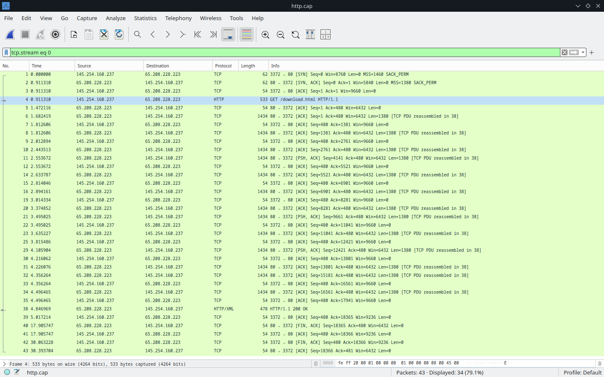
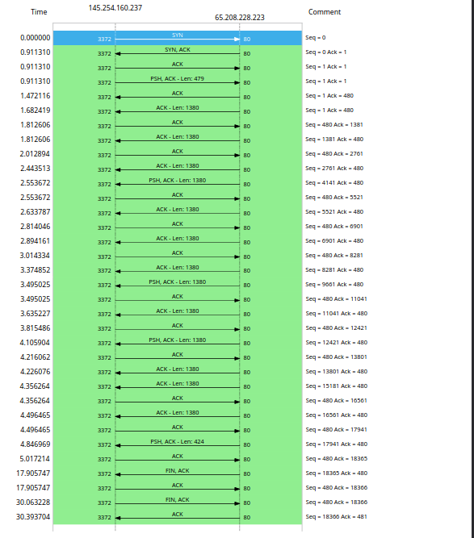
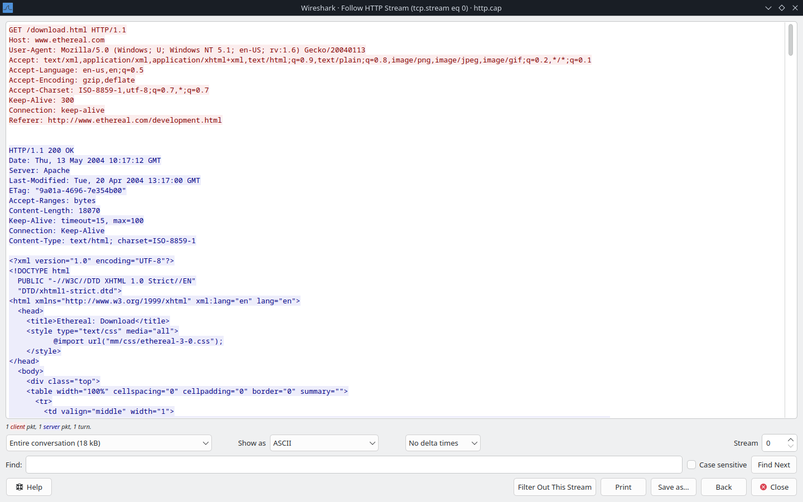

# Socket Programming and Packet Analysis

**Wildan Dharma Walidaniy / 1224800002**
In this assignment, an experiment was conducted to study the basic concepts of `Socket Programming`using a communication channel between the client and server using the TCP protocol and `Packet Analysis` performed with Wireshark.

## Socket Programming

The [server.c](./Scripts/server.c) and [client.c](./Scripts/client.c) programs demonstrate a simple client-server architecture implemented using socket programming in C. The server acts as a centralized communication hub, waiting for client connections and responding to their requests, while the client initiates a connection, sends messages, and receives responses. Both programs rely on the `TCP protocol`, ensuring reliable data transmission between the two endpoints.

### 1. Sockets

A **socket** is an endpoint for sending or receiving data across a network. Both the [server.c](./Scripts/server.c) and the [client.c](./Scripts/client.c) create sockets to establish a communication channel.

+ **Server Socket Creation:**

``` c
    int server_fd = socket(AF_INET, SOCK_STREAM, 0);
```

+ `AF_INET`: Specifies IPv4.
+ `SOCK_STREAM`: Indicates a TCP connection,

+ **Client Socket Creation:**

``` c
    sockfd = socket(AF_INET, SOCK_STREAM, 0);
```

### 2. Sockets

Sockets are bound to an IP address and a port to identify communication endpoints:

+ **Server:**
  + The server binds to **0.0.0.0** (`INADDR_ANY`) and listens on **port 5001**:

    ``` c
    socket_address->sin_addr.s_addr = htonl(INADDR_ANY);
    socket_address->sin_port = htons(port_number);
    bind(server_fd, (const struct sockaddr *) server_sockaddr, server_socklen);
    ```

  + This allows the server to accept connections from any network interface.

+ **Client:**
  + The client connects to the server using **127.0.0.1** (`localhost`) and **port 5001**:

    ``` c
    server = gethostbyname("127.0.0.1");
    serv_addr.sin_port = htons(PORTNO);
    connect(sockfd, (struct sockaddr *)&serv_addr, sizeof(serv_addr));
    ```

### 3. Listening and Accepting Connections

The `server` enters a listening state to wait for incoming client connections:

``` c
    if (listen(server_fd, 3) < 0)

            int client_fd = accept(server_fd, (struct sockaddr *) &client_sockaddr, &client_socklen);
```

+ `listen`: Enables the server to queue up to 3 pending connections.
+ `accept`: Accepts an incoming connection and creates a new socket (`client_fd`) for interacting with the specific client.

### 4. Establishing a Connection

The `client` initiates a connection to the server using the connect function:

``` c
    // connect to the server
    if (connect(sockfd, (struct sockaddr *)&serv_addr, sizeof(serv_addr)) < 0) {
        perror("ERROR while connecting");
        exit(1);
    }
```

This establishes the communication channel between the client socket (`sockfd`) and the `server`.

### 5. Reading and Writing

Both programs use the `read` and `write` system calls for sending and receiving messages:

+ **Server:**

``` c
read(client_fd, buffer, buffer_len);
send(client_fd, response, strlen(response), 0);
```

+ **Client:**

``` c
write(sockfd, buffer, strlen(buffer));
read(sockfd, buffer, BUFFER_SIZE - 1);
```

### 6. Sample Execution

The [MakeFile](./Scripts/Makefile) automates the compilation of the server.c and client.c programs. It contains a single rule, `all`, which compiles both source files into their respective executables.



+ **Output:**




the connection between client and server is monitored and captured on loopback interface using wireshark and saved in [capture.pcapng](./Captured_Packets/capture.pcapng) for further analysis below.

## Packet Analysis

### 1. Captured Packet from [server.c](./Scripts/server.c) and [client.c](./Scripts/client.c) Connection ([capture.pcapng](./Captured_Packets/capture.pcapng))

#### Captured Packets



This the home page of wireshark. The image reveals information about a TCP session between a client and server running on localhost. The overview of the captured packet:

+ Source IP: `127.0.0.1` (localhost)
+ Destination IP: `127.0.0.1` (localhost)
+ Client Port: `51678` (ephemeral port assigned to the client).
+ Server Port: `5001` (defined in [server.c](./Scripts/server.c) as the listening port).
+ Protocol: TCP
+ Number of Packets: 14

#### TCP flow diagram



##### 1. Connection Establishment

The connection starts with the **three-way handshake**, which ensures a reliable connection setup.

+ **Packet 1 (SYN):**
  + **Source:** `51678` → **Destination:** `5001`
  + **Info:** `SYN, Seq=0`
  + **Explanation:** The client initiates the TCP connection by sending a SYN (synchronize) packet to the server's port `5001`.

+ **Packet 2 (SYN-ACK):**
  + Source:** `5001` → **Destination:** `51678`
  + **Info:** `SYN, ACK, Seq=0, Ack=1`
  + **Explanation:** The server acknowledges the client's SYN and sends its own SYN, confirming readiness to establish a connection.

+ **Packet 3 (ACK):**
  + **Source:** `51678` → **Destination:** `5001`
  + **Info:** `ACK, Seq=1, Ack=1`
  + **Explanation:** The client acknowledges the server's SYN-ACK, completing the handshake.

##### 2. Data Exchange

+ **Packet 4 (PSH, ACK):**
  + Source: `51678` → Destination: `5001`
  + **Info:** `PSH, ACK, Seq=1, Ack=1, Len=2`
  + **Explanation:** The client sends the message `'A'` (2 bytes) to the server with the PSH (push) flag, signaling that the data should be delivered immediately.

+ **Packet 5 (CK):**
  + Source: `5001` → Destination: `51678`
  + **Info:** `ACK, Seq=1, Ack=3`
  + **Explanation:** The server acknowledges receipt of the 2 bytes `'A'` from the client.

+ **Packet 6 (PSH, ACK):**
  + Source: `5001` → Destination: `51678`
  + **Info:** `PSH, ACK, Seq=1, Ack=3, Len=2`
  + **Explanation:** The server sends the response `'A'` (2 bytes) back to the client with the PSH flag.

+ **Packet 7 (ACK):**
  + Source: `51678` → Destination: `5001`
  + **Info:** `ACK, Seq=3, Ack=3`
  + **Explanation:** The client acknowledges receipt of the server's response `'A'`.

+ **Packet 8 (PSH, ACK):**
  + Source: `51678` → Destination: `5001`
  + **Info:** `PSH, ACK, Seq=3, Ack=3, Len=5`
  + **Explanation:** The client sends the message `'quit'` (5 bytes) to the server.

+ **Packet 9 (ACK):**
  + Source: `5001` → Destination: `51678`
  + **Info:** `ACK, Seq=3, Ack=8`
  + **Explanation:** The server acknowledges receipt of the `'quit'` message from the client.

+ **Packet 10 (PSH, ACK):**
  + Source: `5001` → Destination: `51678`
  + **Info:** `PSH, ACK, Seq=3, Ack=8, Len=5`
  + **Explanation:** The server sends the response `'quit'` (5 bytes) back to the client with the PSH flag.

+ **Packet 11 (ACK):**
  + Source: `51678` → Destination: `5001`
  + **Info:** `ACK, Seq=8, Ack=8`
  + **Explanation:** The client acknowledges receipt of the server's response `'quit'`.

##### 3. Connection Termination

+ **Packet 12 (FIN, ACK):**
  + Source: `51678` → Destination: `5001`
  + **Info:** `FIN, ACK, Seq=8, Ack=8`
  + **Explanation:** The client initiates connection termination by sending a FIN (finish) packet to the server.

+ **Packet 13 (ACK):**
  + Source: `51678` → Destination: `5001`
  + **Info:** `ACK, Seq=8, Ack=9`
  + **Explanation:** The server acknowledges the client's FIN packet.

+ **Packet 14 (FIN, ACK):**
  + Source: `5001` → Destination: `51678`
  + **Info:** `FIN, ACK, Seq=8, Ack=9`
  + **Explanation:** The server also sends a FIN to close its side of the connection.

+ **Packet 15 (ACK):**
  + Source: `51678` → Destination: `5001`
  + **Info:** `ACK, Seq=9, Ack=9`
  + **Explanation:** The client acknowledges the server's FIN.

### 2. Captured [http.cap](./Captured_Packets/http.cap) Packet obtained from [Wireshark Sample Captures](https://wiki.wireshark.org/samplecaptures#hypertext-transport-protocol-http)

#### Initial captured packets


This is inital Wireshark capture file [http.cap](./Captured_Packets/http.cap) showing network traffic with various protocols, mainly TCP, DNS, and HTTP.

#### TCP filtered


The `tcp.stream eq 0` filter isolates and displays packets that belong to the first TCP stream (stream 0), allowing us to analyze a single TCP connection more closely

#### TCP Flow


For easier analysis, this is graphical representation of the TCP flow between the client (`145.254.160.237:3372`) and the server (`65.208.228.223:80`). This view summarizes the sequence numbers, acknowledgments, and packet lengths for stream `tcp.stream eq 0`

##### 1. TCP Handshake

+ The first three packets (`SYN, SYN, ACK, ACK`) represent the 3-way handshake:
  + `Seq=0` (client) → SYN
  + `Seq=0 Ack=1` (server) → SYN, ACK
  + `Seq=1 Ack=1` (client) → ACK

##### 2. Data Transfer

+ After the handshake, data packets are sent using the `PSH, ACK` flags, indicating that the data should be pushed to the receiving application immediately.
+ The initial data packet (`Seq=1 Ack=1, length 479`) is the client's HTTP request (`GET /download.html`).
+ Subsequent packets are mostly from the server sending data back to the client:
  + **Lengths of 1380 bytes** indicate the server is sending chunks of data, likely the response to the HTTP GET request.
  + The client acknowledges each segment received (`ACK` packets) to maintain flow control.

##### 3. Data Acknowledgment

+ The sequence numbers on the server’s side increase by the lengths of the data sent (mostly 1380 bytes).
+ The client's acknowledgments (`Ack=480, Ack=18305`, etc.) confirm the cumulative data received.

##### 4. Connection Termination

+ Packet with FIN, ACK from the client (Seq=18305 Ack=480) initiates the connection termination.
+ The server responds with its own FIN, ACK (Seq=480 Ack=18306).
+ The final ACK packet from the client completes the connection closure.

#### HTTP request and response



HTTP request and response captured in Wireshark, using the `"Follow HTTP Stream"` feature.

## Resources

+ [C Socket Programming: Simple Server and Client](<https://github.com/ferryastika/socket-programming-simple-server-and-client?tab=readme-ov-file>)
