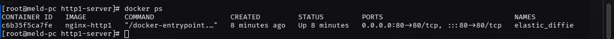
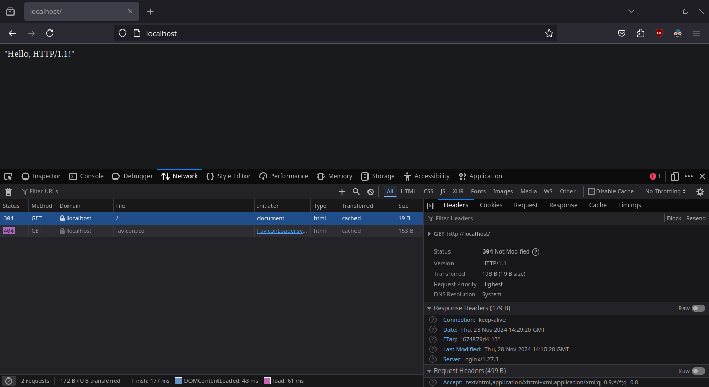
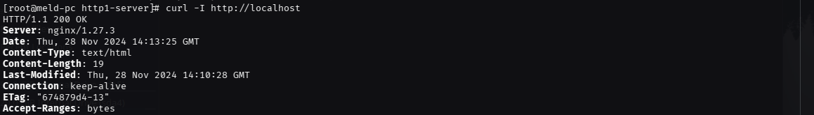
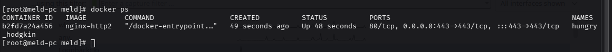
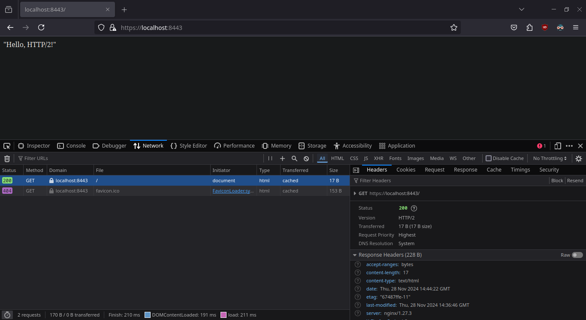
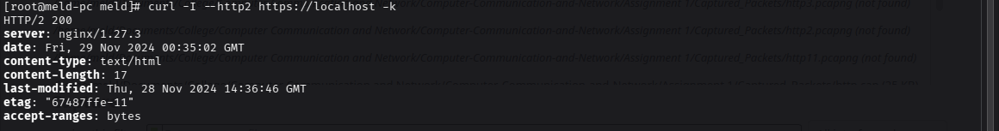
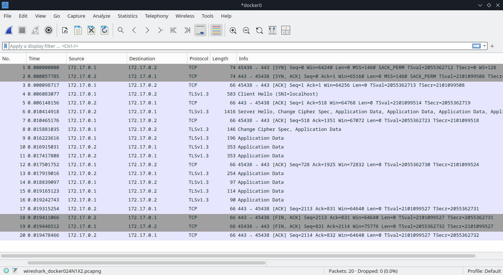
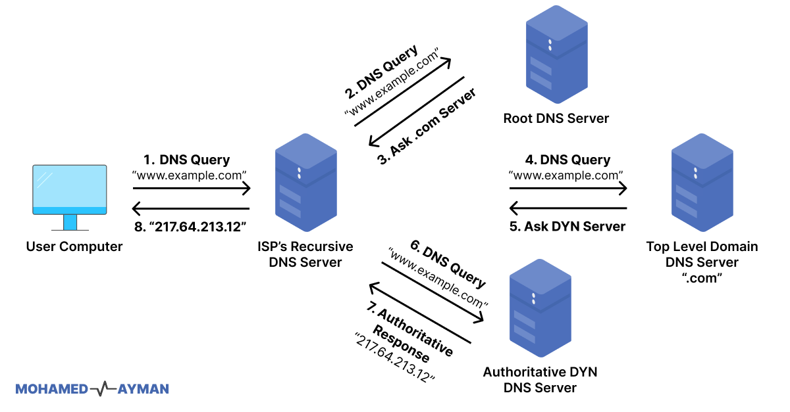
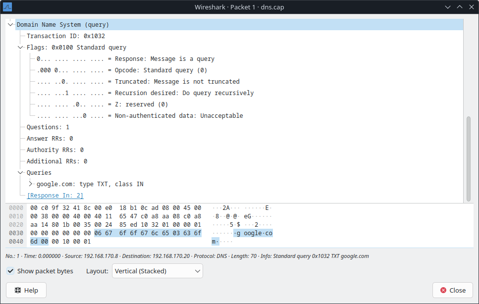
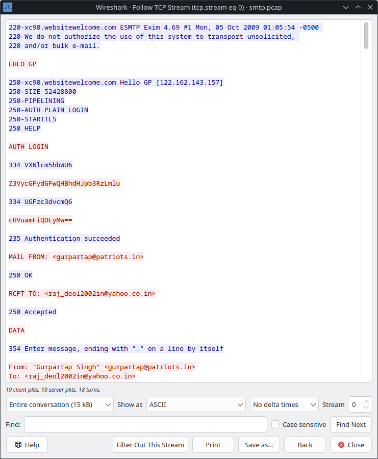

# 1. HTTP Protocol Differences

`HTTP/1.1` and `HTTP/2.0` are versions of the Hypertext Transfer Protocol, the foundation of data communication on the web. Below is a comparison of key differences:

## HTTP/1.1 Server

In this part, the `HTTP/1.1` web server is deployed using Docker.

This web server is configured to use **HTTP/1.1**, as indicated in the response headers where the `Version` is explicitly stated as `HTTP/1.1`. The response status is `304 Not Modified`, meaning the requested resource has not changed since the last access, so no content was sent in the body. The server is running on `nginx/1.27.3`, a modern version of NGINX that supports HTTP/1.1.

The `curl` command confirms that the web server is running **HTTP/1.1** as indicated in the response status line (`HTTP/1.1 200 OK`). The server is identified as `nginx/1.27.3`.

This wireshark capture shows that HTTP/1.1 is used, as indicated by the `GET / HTTP/1.1` request from the client and the `HTTP/1.1 304 Not Modified` response from the server.

## HTTP/2 Server

In this part, the `HTTP/2.0` web server is deployed using Docker.

This web server is configured to use `HTTP/2`, as indicated in the response headers where the Version is explicitly stated as `HTTP/2`. The request was made over a secure connection (`https://localhost:8443/`), which is typical for HTTP/2 since it usually operates over HTTPS. The server runs on nginx/1.27.3, a version that supports `HTTP/2` functionality. The response demonstrates the server's correct operation under `HTTP/2`, returning a `200 OK` status.

The `curl` command confirms that the web server is running **HTTP/2** as indicated in the response status line (`HTTP/2 200`). The server is identified as `nginx/1.27.3`.

# 2. DNS Protocol

The **Domain Name System (DNS)** protocol is a foundational part of the Internet, enabling users to access websites and services by translating human-readable domain names (e.g., `example.com`) into IP addresses (e.g., `192.168.1.1`) that computers use to identify each other on the network.

---

### **How DNS Works**

This flow represents how the DNS (Domain Name System) resolution process works when a user computer requests the IP address for a domain name, like "www.example.com." Here's an explanation of each step:

1. **User Computer to ISP's Recursive DNS Server**  
   The user computer sends a DNS query to its Internet Service Provider's (ISP's) Recursive DNS Server, asking for the IP address of "www.example.com."

2. **ISP's Recursive DNS Server to Root DNS Server**  
   If the recursive DNS server does not already know the answer, it queries the **Root DNS Server**. The Root DNS Server responds by directing the recursive server to the appropriate **Top-Level Domain (TLD) DNS Server** based on the domain suffix (in this case, `.com`).

3. **Root DNS Server Response**  
   The Root DNS Server provides the address of the **.com TLD DNS Server** to the recursive DNS server.

4. **Recursive DNS Server to TLD DNS Server**  
   The recursive DNS server then queries the **TLD DNS Server** (responsible for `.com` domains) for the IP address of "www.example.com."

5. **TLD DNS Server Response**  
   The TLD DNS Server responds with the address of the **Authoritative DNS Server** for "www.example.com" (managed by the hosting provider or domain owner).

6. **Recursive DNS Server to Authoritative DNS Server**  
   The recursive DNS server queries the **Authoritative DNS Server** to get the IP address for "www.example.com."

7. **Authoritative DNS Server Response**  
   The Authoritative DNS Server responds with the IP address, e.g., `217.64.213.12`.

8. **ISP's Recursive DNS Server to User Computer**  
   Finally, the recursive DNS server sends the IP address (`217.64.213.12`) back to the user computer, allowing the user to access the website.

---

### **DNS Protocol Details**

- **Transport Protocol**: DNS typically uses:
  - **UDP (User Datagram Protocol)** on port **53** for most queries.
  - **TCP (Transmission Control Protocol)** on port **53** for larger responses or zone transfers.

- **Query Types**:
  DNS queries can request different types of records, such as:
  - **A Record**: IPv4 address of the domain.
  - **AAAA Record**: IPv6 address of the domain.
  - **CNAME Record**: Canonical name for domain aliases.
  - **MX Record**: Mail server for the domain.
  - **NS Record**: Name servers for the domain.
  - **TXT Record**: Miscellaneous text data.
  - **SOA Record**: Start of Authority, metadata for the domain.

- **DNS Query Modes**:
  - **Recursive Query**: The resolver handles all steps and returns the final result to the client.
  - **Iterative Query**: The resolver queries each DNS server step-by-step, returning what it knows at each stage.

---

### **DNS Packet Structure**
DNS messages consist of two types: **queries** and **responses**, both sharing a similar structure:

1. **Header**:
   - Includes transaction ID, flags (e.g., recursion desired), and question/answer counts.

2. **Question Section**:
   - Contains the domain name being queried and the query type (e.g., A, AAAA).

3. **Answer Section**:
   - Contains resource records (e.g., the IP address) if available.

4. **Authority Section**:
   - Points to authoritative name servers.

5. **Additional Section**:
   - Provides extra information, such as the IP of the authoritative name server.

---

### **DNS Packet Example**

This DNS packet is a **standard query** from a client at IP `192.168.170.8` to a DNS server at IP `192.168.170.20`. It is requesting the **TXT record** for the domain name `google.com` using recursive resolution with the transaction ID `0x1032` ensuring the client can match the response to this specific query.

### **Advanced DNS Features**

1. **DNS Caching**:
   - To improve performance, DNS resolvers and clients cache responses for a certain period, defined by the **Time-To-Live (TTL)** value.

2. **DNS over HTTPS (DoH)**:
   - Encrypts DNS queries over HTTPS, improving privacy by preventing eavesdropping.

3. **DNS over TLS (DoT)**:
   - Similar to DoH but uses TLS for encryption.

4. **Dynamic DNS (DDNS)**:
   - Allows automatic updates of DNS records, often used for devices with dynamic IPs.

5. **Reverse DNS**:
   - Maps an IP address back to a domain name, typically using a **PTR record**.

---

### **Common DNS Issues**
- **DNS Spoofing/Poisoning**:
  Attackers provide fake DNS responses to redirect users to malicious sites.
  
- **DNS Server Unreachable**:
  Indicates network issues or misconfigured DNS settings.
  
- **High Latency**:
  Can occur due to slow recursive resolution or lack of caching.

---

### **Why DNS Matters**
Without DNS, users would need to memorize IP addresses for every website or service they use. The protocol abstracts this complexity, making the Internet user-friendly and scalable.

# 3. SMTP Protocol

The **Simple Mail Transfer Protocol (SMTP)** is a communication protocol used to send, relay, and deliver emails across the Internet. It operates primarily between mail servers and client applications to ensure the efficient transfer of email messages.

---

### **How SMTP Works**

SMTP is a **store-and-forward protocol**, meaning email is transmitted through a series of intermediate servers before reaching its destination. Here's an overview of the process:

#### 1. **Sending Email**
   - A user composes an email in their client application (e.g., Outlook, Thunderbird).
   - The client connects to the sender's SMTP server to transfer the email.

#### 2. **Server-to-Server Transmission**
   - The sender's SMTP server looks up the recipient's mail server using **DNS MX (Mail Exchange)** records.
   - The sender's SMTP server establishes a connection with the recipient's SMTP server to deliver the message.

#### 3. **Final Delivery**
   - The recipient's SMTP server passes the email to a **Mail Delivery Agent (MDA)**, such as an IMAP or POP server.
   - The email is stored on the recipient's mail server until retrieved by the recipient's client.

---

### **SMTP Protocol Details**

- **Transport Protocol**:
  - SMTP operates over **TCP** to ensure reliable delivery.
  - The default port numbers:
    - **25**: Default SMTP port for server-to-server email relay (sometimes blocked for security reasons).
    - **587**: Secure submission of emails from client to server (preferred for outgoing mail).
    - **465**: SMTP over SSL (deprecated but still used by some providers).

- **Commands**:
  SMTP communication consists of a series of commands and responses. Key commands include:
  - **HELO/EHLO**: Identifies the client to the server (EHLO includes support for extensions).
  - **MAIL FROM**: Specifies the sender's email address.
  - **RCPT TO**: Specifies the recipient's email address.
  - **DATA**: Indicates the start of the email message body and headers.
  - **QUIT**: Ends the SMTP session.
  - **RSET**: Resets the session.
  - **AUTH**: Used to authenticate a client (if required).

---

### **SMTP Session Example**

This SMTP session demonstrates the process of sending an email from a client to a server. The connection starts with the SMTP server (`xc90.websitewelcome.com`) identifying itself and warning against the use of its system for unsolicited or bulk email. The client introduces itself with the `EHLO GP` command, and the server responds, listing supported features such as message size limit (50 MB), pipelining, authentication methods (`AUTH PLAIN LOGIN`), and secure connections (`STARTTLS`). The client then authenticates using the `AUTH LOGIN` method, providing the username (`gurpartap@patriots.in`) and password (`punjab@123`) in Base64 format, and the server confirms authentication with a success message. Next, the sender's address is defined with `MAIL FROM: <gurpartap@patriots.in>`, and the recipient's address is specified with `RCPT TO: <raj_deol2002in@yahoo.co.in>`, both of which are accepted by the server. The client begins the email content with the `DATA` command, and the server prompts the client to enter the message, ending with a period (`.`) on a line by itself. The email message includes the sender’s and recipient’s addresses and is finalized with the ending period. The server then accepts the message for delivery, successfully completing the SMTP session.

---

### **SMTP Session Workflow**

1. **Establishing Connection**:
   - The client establishes a TCP connection with the SMTP server.

2. **Handshake**:
   - The client identifies itself with `HELO` or `EHLO`, and the server responds with a status code.

3. **Message Transfer**:
   - The client specifies the sender (`MAIL FROM`) and recipient (`RCPT TO`).
   - The client sends the email content using the `DATA` command.

4. **Server Response**:
   - The server acknowledges the successful receipt of the message.

5. **Session Termination**:
   - The client closes the connection with the `QUIT` command.

---

### **SMTP Commands and Status Codes**

#### **Key Commands**
| Command    | Description                                |
|------------|--------------------------------------------|
| `HELO`     | Identifies the client to the server.       |
| `EHLO`     | Extended version of HELO for modern SMTP. |
| `MAIL FROM`| Specifies the sender’s address.            |
| `RCPT TO`  | Specifies the recipient’s address.         |
| `DATA`     | Indicates the start of the message body.   |
| `RSET`     | Resets the current session.                |
| `QUIT`     | Ends the session.                         |
| `AUTH`     | Initiates client authentication.           |

#### **Common Status Codes**
| Code | Meaning                                      |
|------|----------------------------------------------|
| 220  | Server ready to start a session.             |
| 250  | Requested action completed successfully.     |
| 354  | Start email input (after `DATA` command).    |
| 421  | Service not available (temporary issue).     |
| 450  | Action not taken (e.g., mailbox unavailable).|
| 550  | Requested action failed (e.g., mailbox full).|

---

### **SMTP Security Extensions**

SMTP was designed without encryption, but modern enhancements address security concerns:

1. **STARTTLS**:
   - Upgrades the connection to use TLS encryption.
   - Prevents plaintext email content from being intercepted.

2. **SMTP AUTH**:
   - Requires users to authenticate before sending email, reducing spam and unauthorized use.

3. **SPF, DKIM, and DMARC**:
   - Authentication mechanisms to prevent email spoofing and phishing.

4. **SSL/TLS (Port 465)**:
   - Uses encrypted communication from the start of the connection.

---

### **SMTP vs Other Email Protocols**
| Protocol | Purpose                              | Example Ports |
|----------|--------------------------------------|---------------|
| **SMTP** | Sending and relaying emails.         | 25, 587, 465  |
| **IMAP** | Retrieving emails (with server sync).| 143, 993      |
| **POP3** | Downloading emails (local storage).  | 110, 995      |

---
