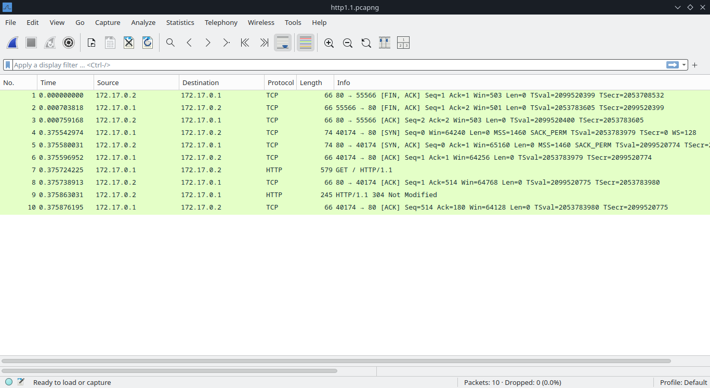

# 1. HTTP Protocol Differences

`HTTP/1.1` and `HTTP/2.0` are versions of the Hypertext Transfer Protocol, the foundation of data communication on the web. Below is a comparison of key differences:

## HTTP/1.1 Server

In this part, the `HTTP/1.1` web server is deployed using Docker.

This web server is configured to use **HTTP/1.1**, as indicated in the response headers where the `Version` is explicitly stated as `HTTP/1.1`. The response status is `304 Not Modified`, meaning the requested resource has not changed since the last access, so no content was sent in the body. The server is running on `nginx/1.27.3`, a modern version of NGINX that supports HTTP/1.1.

The `curl` command confirms that the web server is running **HTTP/1.1** as indicated in the response status line (`HTTP/1.1 200 OK`). The server is identified as `nginx/1.27.3`.

This wireshark capture shows that HTTP/1.1 is used, as indicated by the `GET / HTTP/1.1` request from the client and the `HTTP/1.1 304 Not Modified` response from the server.

## HTTP/2 Server

In this part, the `HTTP/2.0` web server is deployed using Docker.

This web server is configured to use `HTTP/2`, as indicated in the response headers where the Version is explicitly stated as `HTTP/2`. The request was made over a secure connection (`https://localhost:8443/`), which is typical for HTTP/2 since it usually operates over HTTPS. The server runs on nginx/1.27.3, a version that supports `HTTP/2` functionality. The response demonstrates the server's correct operation under `HTTP/2`, returning a `200 OK` status.

The `curl` command confirms that the web server is running **HTTP/2** as indicated in the response status line (`HTTP/2 200`). The server is identified as `nginx/1.27.3`.

