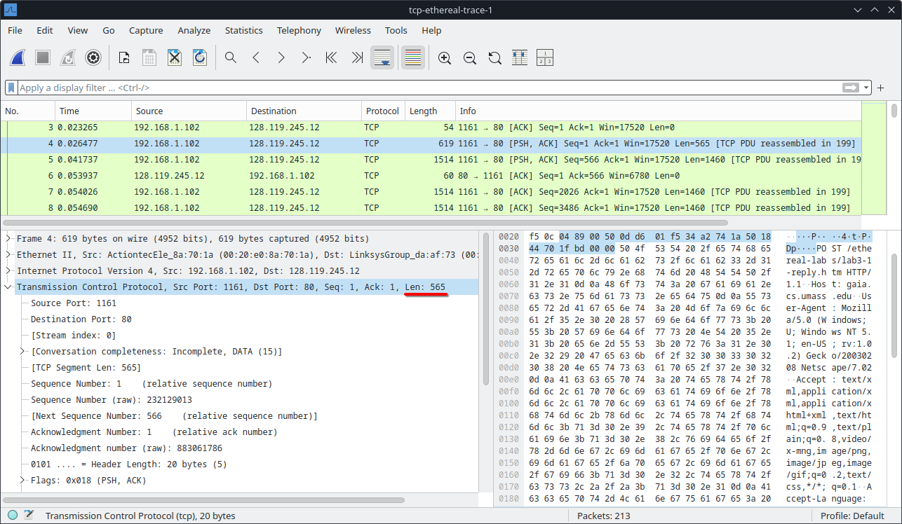

# Wildan Dharma Walidaniy

## Student ID: 1224800002  

### Program: S2 IT  

---

## UAS Komunikasi dan Jaringan Komputer  

### Source

The trace file for this test (`tcp-ethereal-trace-1`) was obtained from [Wireshark Labs](http://gaia.cs.umass.edu/wireshark-labs/wireshark-traces.zip).

---

### Questions for the TCP Segments

1. **What is the IP address and TCP port number used by your client computer (source) to transfer the file to `gaia.cs.umass.edu`? (10%)**  
   - To identify the correct packet transferring a file to `gaia.cs.umass.edu`, the display filter `http.host == "gaia.cs.umass.edu"` was applied.  
   - Examining the filtered packets for HTTP POST requests reveals that **packet number 199** transfers the file.  
   
   - **Client computer (source):**  
     - IP address: `192.168.1.102`  
     - TCP port number: `1161`  
  
      **Solution:**
     
      https://github.com/user-attachments/assets/a60b221a-b33b-45b3-b77c-17dc1588dc28

---

2. **What does `gaia.cs.umass.edu` use as the IP address and port number to receive the file? (Attach the screenshot of your Wireshark's display) (10%)**
     
   - Destination information can be found in **packet number 199**:  
     - **Destination computer:** `gaia.cs.umass.edu`  
     - IP address: `128.119.245.12`  
     - TCP port number: `80`  

---

3. **What is the sequence number of the TCP SYN segment that is used to initiate the TCP connection? What identifies the segment as a SYN segment? (Attach the screenshot of your Wireshark's display) (10%)**  
   
   - **Sequence number:** `0`  
   - The SYN flag is set to `1`, identifying it as a SYN segment.  

---

4. **What is the sequence number of the SYNACK segment sent by `gaia.cs.umass.edu` in reply to the SYN? What is the value of the ACK field? How is this value determined? (Attach the screenshot of your Wireshark's display) (10%)**  
   
   - **Sequence number:** `0`  
   - **ACK field value:** `1`  
   - The server (`gaia.cs.umass.edu`) calculates this value by adding `1` to the initial sequence number from the client.  

---

5. **What is the sequence number of the TCP segment containing the HTTP POST command? (Attach the screenshot of your Wireshark's display) (15%)**
     
   - The sequence number of the HTTP POST command (segment No. 4): `1`.  

---

6. **Sequence numbers and RTT details of the first six TCP segments (including the HTTP POST): (30%)**
   
   *Segments 1 – 6*
   
   *ACKs of segments 1 - 6*

   **Segments and ACKs:**  
   - HTTP POST segment is considered as Segment 1.  
   - Segments: 4, 5, 7, 8, 10, and 11  
   - ACKs: 6, 9, 12, 14, 15, and 16  

   **Sequence Numbers:**  
   - Segment 1: `1`  
   - Segment 2: `566`  
   - Segment 3: `2026`  
   - Segment 4: `3486`  
   - Segment 5: `4946`  
   - Segment 6: `6406`  

   **RTT Table:**  

   | Segment | Sent Time (s) | ACK Received Time (s) | RTT (s) |
   |---------|---------------|-----------------------|---------|
   | 1       | 0.026477      | 0.053937             | 0.02746 |
   | 2       | 0.041737      | 0.077294             | 0.035557 |
   | 3       | 0.054026      | 0.124085             | 0.070059 |
   | 4       | 0.054690      | 0.169118             | 0.11443  |
   | 5       | 0.077405      | 0.217299             | 0.13989  |
   | 6       | 0.078157      | 0.267802             | 0.18964  |

   **EstimatedRTT Calculation:**  
   - `EstimatedRTT = 0.875 * Previous EstimatedRTT + 0.125 * SampleRTT`  

   **Values:**  
   - After Segment 1 ACK: `0.02746`  
   - After Segment 2 ACK: `0.0285`  
   - After Segment 3 ACK: `0.0337`  
   - After Segment 4 ACK: `0.0438`  
   - After Segment 5 ACK: `0.0558`  
   - After Segment 6 ACK: `0.0725`  

   
   *Round Trip Time Graph*

---

7. **What is the length of each of the first six TCP segments? (Attach the screenshot of your Wireshark's display) (15%)**
   
   *first TCP segment*
   
   *2nd-6th segment has the same size*

   - Length of the first TCP segment (HTTP POST): `565 bytes`  
   - Length of each of the other five segments: `1460 bytes` (Maximum Segment Size).  
